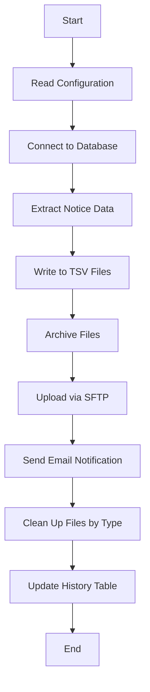

# Evergreen Shoutbomb SMS Extract

This software extracts notice data from an Evergreen server and securely transfers the output to Shoutbomb's SFTP server for SMS notification processing. It consists of three separate scripts that can be scheduled to run at different intervals to provide timely SMS notifications to library patrons.


## Features

- **Three Extract Types**: Separate scripts for patron preferences, daily notices (courtesy/overdue), and hourly hold notices.
- **Modular Design**: Components are divided into reusable modules for better maintainability and readability.
- **Smart Cleanup**: Type-specific cleanup of temporary and archive files to prevent interference between scripts.
- **Email Notifications**: Configurable email notifications on success or failure, with detailed logs.
- **SFTP Transfer**: Secure file transfer to Shoutbomb's server over SSH File Transfer Protocol.
- **Progress Tracking**: History tables track last run times for each extract type.

## Directory Structure

```bash
📁 archive/                      # Archived output files
    ├── 📄 .gitkeep
📁 config/                       # Configuration files
    └── ⚙️ shoutbomb_config.conf.example
📁 lib/                          # Perl modules
    ├── 🐪 DBUtils.pm            # Database utilities
    ├── 🐪 Email.pm              # Email functions
    ├── 🐪 SFTP.pm               # SFTP transfer functions
    ├── 🐪 Logging.pm            # Logging functions
📁 sql/                          # SQL query files
    ├── 🗃️ notice_prefs.sql      # Patron notification preferences
    ├── 🗃️ hold_notice.sql       # Hold ready notifications
    ├── 🗃️ courtesy_notice.sql   # Courtesy (pre-due) notifications
    └── 🗃️ overdue_notice.sql    # Overdue item notifications
📁 tmp/                          # Temporary file storage
    ├── 📄 .gitkeep
📁 test/                         # Test scripts
    ├── 🐪 email_test.pl         # Test email functionality
    ├── 🐪 sftp_test.pl          # Test SFTP functionality
🐪 extract_notice_prefs.pl       # Daily patron preferences extract
🐪 extract_daily_notices.pl      # Daily courtesy/overdue notices
🐪 extract_hold_notices.pl       # Hourly hold notifications
📄 README.md                     # This documentation
```

## Installation

1. Clone the repository:
    ```bash
    git clone git@gitlab.biblio.org:evergreen/evergreen-code/support-scripts/shoutbomb-extract.git
    cd shoutbomb-extract
    ```

2. Copy the example configuration file and edit it:
    ```bash
    cp config/shoutbomb_config.conf.example config/shoutbomb_config.conf
    vi config/shoutbomb_config.conf
    ```

3. Install the required Perl modules:
    ```bash
    cpan install DBI DBD::Pg Net::FTPSSL Email::MIME Email::Sender::Simple Try::Tiny DateTime File::Spec
    ```

4. Make the scripts executable:
    ```bash
    chmod +x *.pl
    ```

## The Three Extract Scripts

### 1. Patron Notification Preferences (`extract_notice_prefs.pl`)

This script extracts patron SMS notification preferences, including phone numbers, barcodes, and language settings. It should be run daily to keep Shoutbomb's system updated with the latest subscriber information.

```bash
./extract_notice_prefs.pl --config config/shoutbomb_config.conf
```

### 2. Daily Notices (`extract_daily_notices.pl`)

This script extracts two types of notices:
- **Courtesy notices**: Items due within the next few days
- **Overdue notices**: Items that are past their due date

It should be run once a day, ideally after morning circulation processes like dropbox check-ins and auto-renewals.

```bash
./extract_daily_notices.pl --config config/shoutbomb_config.conf
```

### 3. Hold Notices (`extract_hold_notices.pl`)

This script extracts information about holds that are ready for pickup. It should be run hourly during operating hours to ensure patrons receive timely notifications when their requested items become available.

```bash
./extract_hold_notices.pl --config config/shoutbomb_config.conf
```

## Configuration Options

Edit the `config/shoutbomb_config.conf` file to customize your setup:

| Configuration Option        | Description                                                 |
| --------------------------- | ----------------------------------------------------------- |
| `logfile`                   | Path to the log file                                        |
| `tempdir`                   | Temporary directory for processing files                    |
| `archive`                   | Directory for storing archived files                        |
| `cleanup`                   | Whether to clean up old archive files (1=yes, 0=no)         |
| `librarynames`              | Comma-separated list of branch shortnames to include        |
| `include_org_descendants`   | Include child organizations of listed branches              |
| `filenameprefix`            | Prefix for all output filenames                             |
| `ftphost`                   | Shoutbomb SFTP server hostname                              |
| `ftplogin`                  | SFTP username                                               |
| `ftppass`                   | SFTP password                                               |
| `remote_directory`          | Directory on Shoutbomb's server to upload files             |
| `fromemail`                 | Email address to send notifications from                    |
| `erroremaillist`            | Comma-separated list of addresses for error notifications   |
| `successemaillist`          | Comma-separated list of addresses for success notifications |
| `alwaysemail`               | Email address that always receives notifications            |
| `compressoutput`            | Optional: Compress output files (uncomment in config to enable) |

### Hold Notice Email Configuration

For hold notices that run frequently (hourly), you can control email notifications with these options:

| Configuration Option      | Description                                                        |
| ------------------------- | ------------------------------------------------------------------ |
| `hold_email_strategy`     | Strategy for sending hold notice emails (see options below)        |
| `hold_email_threshold`    | Minimum number of hold notices to trigger emails in threshold mode |
| `hold_email_summary_hour` | Hour of day (0-23) to send daily summary in daily_summary mode    |

Available strategies for `hold_email_strategy`:
- `errors_only` (default): Send emails only when errors occur
- `always`: Send emails for every hold extract (may generate many emails)
- `threshold`: Send emails only when hold count exceeds the threshold value
- `daily_summary`: Send one summary email per day at the specified hour

## Command Line Options

All scripts support these common options:

| Option                    | Description                                                   |
| ------------------------- | ------------------------------------------------------------- |
| `--config FILE`           | Path to config file (default: shoutbomb_config.conf)          |
| `--evergreen-config FILE` | Path to Evergreen config (default: /openils/conf/opensrf.xml) |
| `--debug`                 | Enable verbose debug logging                                  |
| `--dry-run`               | Run in test mode without sending emails or uploading files    |

## Smart File Cleanup

The system uses a type-aware cleanup strategy to manage temporary and archived files:

1. **Temporary Files**: 
   - Each script only cleans up its own temporary files, identified by extract type
   - This prevents scripts from interfering with each other when running concurrently

2. **Archive Files**:
   - For `notice_prefs` and `daily_notices`: Only the most recent file of each type is kept
   - For `hold_notices`: The 3 most recent hourly files are retained
   - Older files are automatically purged to save disk space

This approach ensures that important files remain available for troubleshooting while preventing excessive disk usage.

## Testing Tools

The package includes utilities in the `test` directory to test the core functionality:

- **test/email_test.pl**: Sends a test email to verify your email configuration
- **test/sftp_test.pl**: Tests SFTP connectivity with the `--file` option pointing to a test file

To run these test utilities:

```bash
# Test email functionality
cd test
./email_test.pl

# Test SFTP functionality
cd test
./sftp_test.pl --file path/to/test/file
```

These test scripts use the same configuration file (`config/shoutbomb_config.conf`) as the main extract scripts.

## Cron Job Setup

To automate the extraction process, add these entries to your crontab (`crontab -e`):

```bash
# Patron preferences - daily at 1:00 AM
0 1 * * * /path/to/extract_notice_prefs.pl --config /path/to/config/shoutbomb_config.conf

# Courtesy and overdue notices - daily at 11:00 AM
0 11 * * * /path/to/extract_daily_notices.pl --config /path/to/config/shoutbomb_config.conf

# Hold notices - hourly during library hours
0 8-20 * * * /path/to/extract_hold_notices.pl --config /path/to/config/shoutbomb_config.conf
```

## Process Flow

Each script follows this general workflow:



## Troubleshooting

- **Check Logs**: The logfile specified in your config contains detailed information about each run
- **Test Connections**: Use the `email_test.pl` and `sftp_test.pl` scripts to verify connectivity
- **Run with Debug**: Add the `--debug` flag to get verbose output
- **Test Without Network**: Use `--dry-run` to test data extraction without network operations
- **Check Archive Directory**: Recent files are kept in the archive directory for manual verification

## License

This software is distributed under the GNU General Public License v2 or later.
